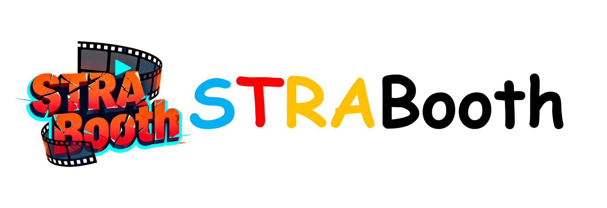

<p align="center" >
    
</p>

# <div align="center" >Subject-Motion Representation Alignment for Customized Video Generation<div align="center">

<div align="center">
  <p>
    <a href="https://xuxuancheng0208.github.io/">Xuancheng Xu</a><sup>1</sup>
    <a href="https://www.scholat.com/bkbao.en">Bing-kun Bao</a><sup>1,2✉</sup>
  </p>
  <p>
    <sup>1</sup>Nanjing University of Posts and Telecommunications &nbsp;&nbsp;
    <sup>2</sup>Peng Cheng Laboratory &nbsp;&nbsp;
    <sup>✉</sup>Corresponding author
  </p>
</div>

<br>

<p align="center">
  <a href='https://smrabooth.github.io/'></a>
  &nbsp;
  <a href=""></a>
  &nbsp;
  <a href=''></a>
</p>

## 🔥 Updates

## ⚙️ Setup
####  Step 1: Set up the environment
```python
conda create -n smraboothwan python=3.10.18
conda activate smraboothwan
conda install pytorch==2.4.1 torchvision==0.19.1 torchaudio==2.4.1 pytorch-cuda=12.1 -c pytorch -c nvidia
pip install -r requirements.txt

git+https://github.com/modelscope/DiffSynth-Studio.git@v1.1.7
cd DiffSynth-Studio
pip install -e .
```
####  Step 2: Download the pretrained checkpoint

####  Step 3: Prepare the customized datasets for subject and video


